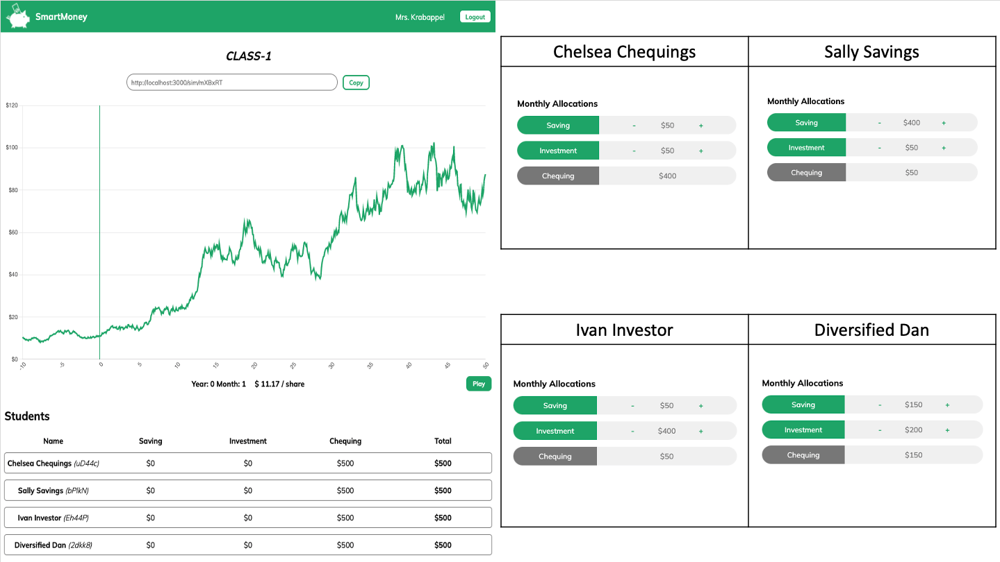
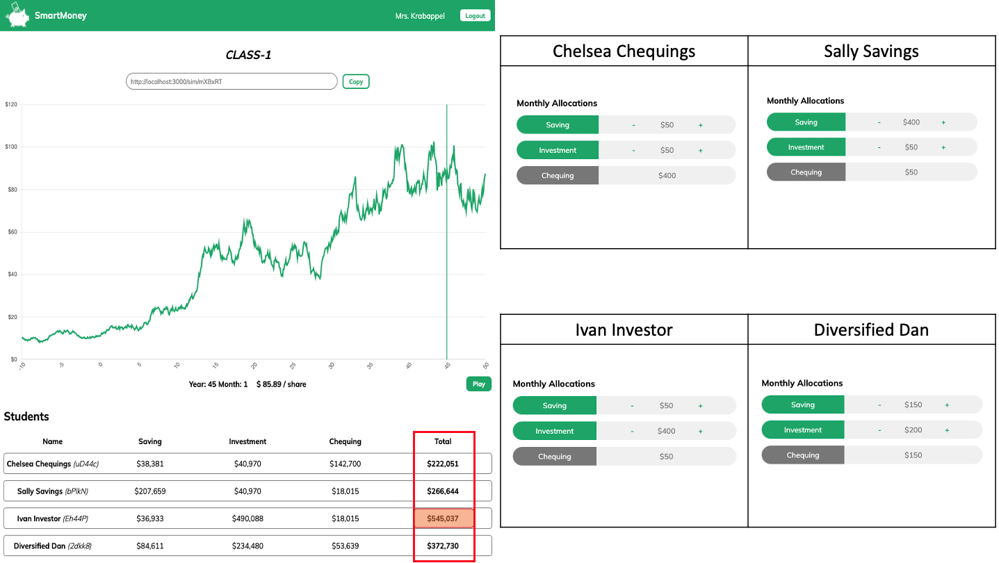

# **SmartMoney**

SmartMoney is an app that teachers can use to introduce students to the concept of investment and show them how it is a smart way to grow their money.

## **App Demo**

### Teacher Login and Creating New Simulation

(<a href="#top">back to top</a>)

### Student Login and Running Simulation

(<a href="#top">back to top</a>)

### Simulation Results

Comparison of students' total account balance before and after simulation, which differs depending on how they allocated their money monthly

(<a href="#top">back to top</a>)

## Getting Started

(<a href="#top">back to top</a>)

## Dependencies

* [PostgreSQL](https://www.postgresql.org/)
* [Express](https://expressjs.com/)
* [React.js](https://reactjs.org/)
* [Node](https://nodejs.org/en/)
* [Socket.IO](https://socket.io/)
* [GraphQL](https://graphql.org/)

(<a href="#top">back to top</a>)

## Team

|| **Jeffery Park** | **Kurtis Grant** | **Rob Gladue** |
| :---: | :---: | :---: | :---: |
| GitHub | [smjeffery22](https://github.com/smjeffery22) | [kurtisgrant](https://github.com/kurtisgrant) | [rgladue](https://github.com/rgladue) |
| Resume | [Jeffery](https://resume.creddle.io/resume/66ftukuaggu) | [Kurtis](https://resume.creddle.io/resume/hzvbxzuacop) | [Rob](https://docs.google.com/document/d/1jdIRz-JX602jj6sykefnLVxy680dyEF_/edit?usp=sharing&ouid=115984325978150255813&rtpof=true&sd=true) |
| LinkedIn | [in/jeffery-park-jp](https://www.linkedin.com/in/jeffery-park-jp) | [in/kurtis-grant](https://github.com/kurtisgrant) | [in/robert-gladue](https://www.linkedin.com/in/robert-gladue) |

(<a href="#top">back to top</a>)
